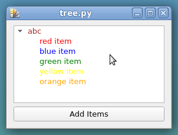
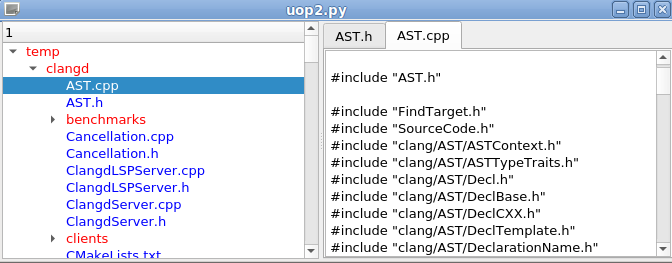
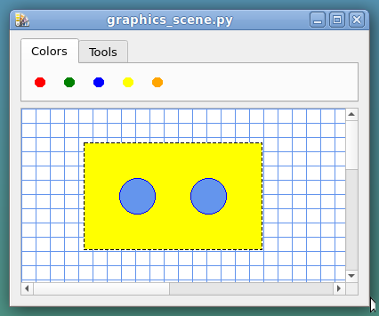
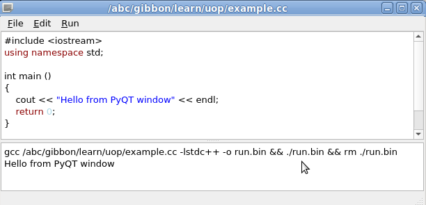
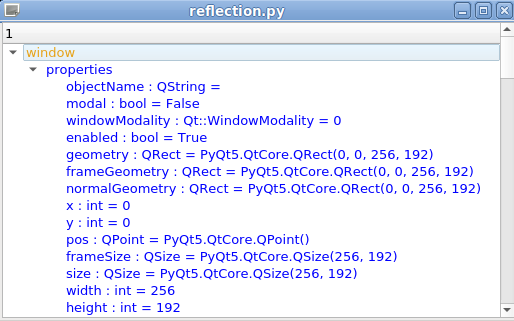

PyQt examples
=============

[button.py](simple/button.py) ... QPushButton, button.clicked.connect

[tree.py](simple/tree.py) ... QTreeWidget

[paint.py](simple/paint.py) ... paintEvent, QPainter

[file_tree.py](simple/file_tree.py) ... directories, files, show file in QTextEdit

[file_crc.py](simple/file_crc.py) ... calculate crc

[svg.py](simple/svg.py) ... QSvgWidget, QNetworkRequest

[xml.py](simple/xml.py) ... QXmlStreamReader

[sqlite.py](simple/sqlitel.py) ... QSqlDatabase, QSqlQuery, QTableView

[rpm_view.py](simple/rpm_view.py) ... list RPM packages on Fedora

[graphics_scene.py](simple/graphics_scene.py ) ... QGraphicsScene, drag and drop

[edit.py](editor/editor.py ) ... QTextEdit

[editor.py](editor/editor.py ) ... QSyntaxHighlighter, QCompleter

[reflection.py](reflection/reflection.py ) ... display properties, list signals, slots and methods

